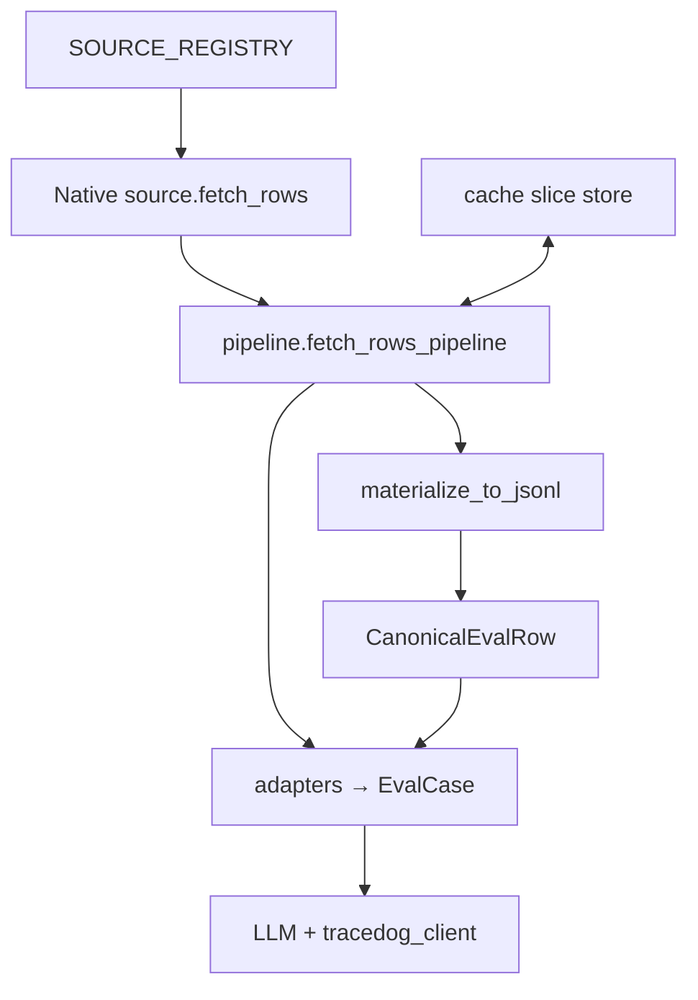

# Evaluation data sources

This package is the **data plane** for benchmark runs: **registry → fetch pipeline → (optional) canonical materialization → adapters/runners**. It is structured so TraceDog can grow toward **versioned, reproducible, scheduled** evaluation without rewriting runners for every new dataset.

## Layered design (strong-Infra style)

| Layer | Module(s) | Purpose |
|-------|-----------|---------|
| **1. Dataset registry** | `registry.py`, `SOURCE_REGISTRY` | Discover sources by **id**, list **splits**, **tags**, **schema** hints; build instances without hardcoding runners. |
| **2. Native fetch** | `squad_v2.py`, `hotpot_qa.py`, `types.EvalRowSource` | Load **raw** `dict` rows (HF, local JSON). |
| **3. Versioned identity** | `types.SourceDescriptor`, `with_slice_and_hash` | **dataset_id**, **dataset_version**, HF **revision** (optional), **slice_spec**, **source_hash** over the fetched slice. |
| **4. Canonical model** | `canonical.py` | **`CanonicalEvalRow`** (`canonical_v1`): stable **input / reference / tags** + **`raw`** for legacy adapters. |
| **5. Cache** | `cache.py` | Filesystem **slice cache** keyed by descriptor + offset/limit (`TRACE_EVAL_SOURCE_CACHE` or `evaluation/.cache/source_fetches`). |
| **6. Pipeline** | `pipeline.py` | **Retries** (HF/network), **row validation** + quarantine, **stats** (fetch ms, rows, quarantined, cache hit, attempts). |
| **7. Materialize** | `materialize.py` | **Source → normalize → JSONL** + `.provenance.json` sidecar (portable, debuggable, CI-friendly). |
| **8. Lineage** | `lineage.py` | **Run metadata**: git SHA, timestamp, model/provider, **descriptor**, **pipeline stats**, prompt/scoring version stamps for `ingest_metadata`. |



Runners today default to **pipeline → raw dict → adapter**. **`--materialized`** loads **canonical JSONL** and uses **`row.raw`** so adapters stay unchanged.

## Environment variables

| Variable | Meaning |
|----------|---------|
| `TRACE_EVAL_SOURCE_CACHE` | Root dir for slice cache (default: `evaluation/.cache/source_fetches`). |
| `TRACE_EVAL_USE_SOURCE_CACHE` | If `1` / `true` / `yes`, runners enable cache without `--source-cache`. |
| `TRACE_EVAL_GIT_SHA` | Override git commit recorded in **`eval_lineage`** (e.g. CI). |
| `TRACE_EVAL_RUN_ID` | Correlate **`source_fetch_complete`** events with **`eval_lineage.run_id`** (generated UUID if unset). |
| `TRACE_EVAL_PIPELINE_EVENTS_JSONL` | Append one JSON object per pipeline event (JSONL metrics / log sink). |
| `TRACE_EVAL_PIPELINE_EVENTS_STDERR` | If `1` / `true` / `yes`, also print each event as one JSON line on stderr. |

## HF revision pins

Public Hugging Face loads use **pinned dataset repo commits** from `hf_revisions.py` (also on each `DatasetRegistryEntry` as `huggingface_revision`). **CI** runs `evaluation/scripts/verify_hf_dataset_revisions.py` to ensure each pin still resolves. **Bump pins** when you intentionally move to a new snapshot; refresh SHAs via `huggingface_hub.HfApi().dataset_info(..., revision="main").sha` (see docstring in `hf_revisions.py`).

Structured **`source_fetch_complete`** events include: `run_id`, `dataset_id`, `cache_hit`, `fetch_ms`, `rows_loaded`, `rows_quarantined`, `fetch_attempts`, `offset`, `limit`, `load_mode`, and `source_descriptor` (with **`revision`** when applicable).

## CLI: materialize (offline / CI / shared snapshots)

From repo root:

```bash
PYTHONPATH=. python -m evaluation.sources.materialize \
  --dataset squad_v2 \
  --out evaluation/.cache/materialized/squad_val_500.jsonl \
  --offset 0 --limit 500 --split validation \
  --source-cache

PYTHONPATH=. python -m evaluation.runners.run_squad_eval \
  --materialized evaluation/.cache/materialized/squad_val_500.jsonl \
  --limit 500 --experiment squad-from-snapshot
```

Hotpot:

```bash
PYTHONPATH=. python -m evaluation.sources.materialize \
  --dataset hotpot_qa_fullwiki \
  --out /tmp/hotpot_slice.jsonl \
  --limit 100 \
  --json-path data/hotpot/hotpot_dev_fullwiki_v1.json
```

Each output gets a **`*.provenance.json`** sidecar (descriptor, stats, row counts).

## Runner: caching and lineage

- **`--source-cache`** — reuse the raw slice on disk for the same descriptor + offset/limit.
- **`--materialized`** — evaluate from a prior **canonical JSONL** (reproducible slice).
- **`ingest_metadata.eval_lineage`** — nested blob with **source descriptor**, **pipeline stats**, **git**, **timestamp**, **prompt_version** / **scoring_version** (for “why did scores move?”).

## Implemented registry entries

| `source_id` | Tags (subset) | Splits |
|-------------|---------------|--------|
| `squad_v2` | `single_hop`, `mrc`, `rag`, `factuality` | train, validation |
| `hotpot_qa_fullwiki` | `multi_hop`, `mrc`, `rag`, `factuality` | train, validation, test (+ local JSON path) |

List in code: `from evaluation.sources import list_registry_entries`.

## Adding a dataset (checklist)

1. **`DatasetRegistryEntry`** in `registry.py` (id, splits, tags, `raw_schema_version`, `build=` factory).
2. **Source class** implementing `fetch_rows` + `describe()` with **dataset_id / dataset_version** filled.
3. **Normalizers** — add `normalize_*` + register in `canonical.NORMALIZER_BY_REGISTRY_ID`.
4. **Validation** — extend `pipeline.validate_raw_row` (fail or quarantine).
5. **Adapter** under `evaluation/runners/adapters/`.
6. **Runner** or generic loop; wire **`fetch_rows_pipeline`** + **`collect_lineage`** like SQuAD/Hotpot.
7. **Materialize** — add branch in `materialize_to_jsonl` if kwargs differ from existing patterns.

## Observability (data plane)

`PipelineStats` (and stderr logs via `log_pipeline_stats`) report:

- **fetch_ms**, **rows_loaded**, **rows_quarantined**, **cache_hit**, **fetch_attempts**, **normalization_failures** (materialize), **materialization_ms**.

A future backend metrics sink can ingest the same shape without changing runners.

## Parquet / corporate “full” pipelines

**Parquet** (and **shared blob stores**, **scheduled Airflow**, **customer trace replay**) are natural extensions of **materialized JSONL + provenance**; adding `pyarrow` or an internal export job fits the same **`CanonicalEvalRow`** contract without changing TraceDog’s API.

## Testing

Full command list: **[`evaluation/README.md`](../README.md)** → **Test the data pipeline** (pytest, `run_data_pipeline_tests.sh`, dry-run). The dashboard **Trace health** page has copyable versions for operators.

```bash
cd /path/to/TraceDog
PYTHONPATH=. python -m pytest evaluation/tests/ -q
```

## See also

- **[`evaluation/README.md`](../README.md)** — LLM keys, runner flags, CGGE metrics.
- **Adapters** — `evaluation/runners/adapters/` map **raw** or **`canonical.raw`** → `EvalCase`.
